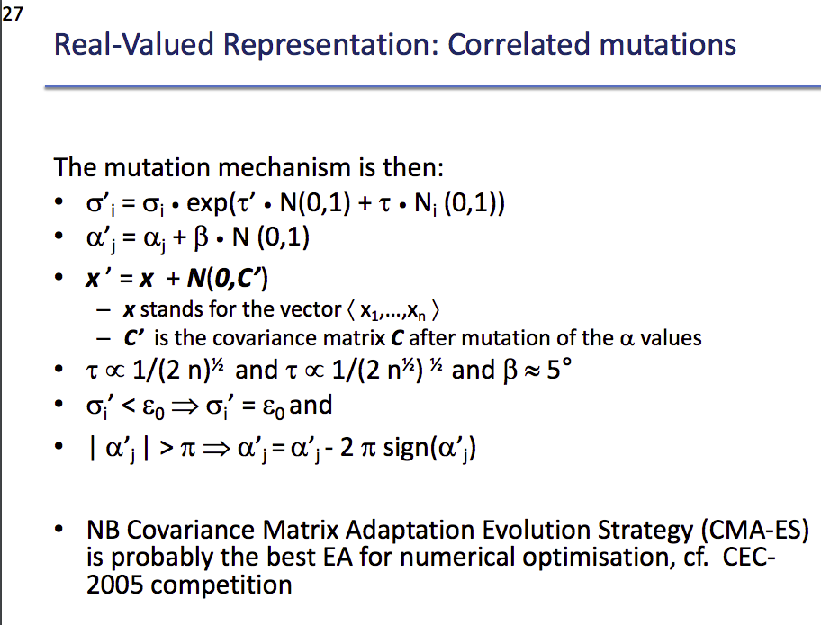

# Research Question Proposal

## from G. Cao

I proposed several questions that all have to do with some deep neural network optimization tricks, like the varients of SGD.

1. Does working on small batch over a large population help envolutional algorithm converge?

   Typically we use all of the population in the envolutional algorithm. In some cases we have large population, and then randomly choose a batch and conduct algorithm on it, like what is said in the slides of chap 5. My question is, if we manually use a large population, say 1000 individuals, on a question that originally only need to use 10 individuals, but conduct the algorithm on the randomly chosen minibatch of size 10, will it work better or not? It is a rather open problem, I am not sure what the answer is. On one hand, greater population size gives the algorithm more exploring ability, on the other hand, larger population means it takes long time to move the population as a whole. I think it is worth to dive into it to see how the performace is as the population size goes greater.

2. Can we introduce momentum to EA to make it converge faster?

   I guess it does have some nontrivial effect to introduce the momentum when optimizing unimodel function. The way I want to implement it is either collect the statistcs of the population mean across the  time steps, and use it to update the $\mu$ of the normal distribution we use in the mutation phase, or, we could add the $\mu$ to the chromosomes and optimize it with respect of the fitness function, just like what CMA-ES does.

   

   > CMA-ES algorithm

3. Introducing crossover to CMA-ES

   CMA-ES algorithm seems only adopt mutation. But can we also add the parameter of crossover, such like the mix-rate if it is the mix crossover, or the probablity to make crossover for each instance, to the chromosome?

4. Do ES works well at saddle point?

   If it is not the case, then what can we do to make up for this problem?

5. Can we combine the gradient based method with the intuitive EA?

   As we know, gradient provide us with the local structure of the function surface. So will knowing the gradient of the funciton gives us a bonus on performing EA? My guess is we can utilize it to have more meaningful local exploration, such as using the direction of gradient as the $\mu$ vector of mutation distribution, using the momentum of gradient to be the $\sigma$  of the distribution and so on.

