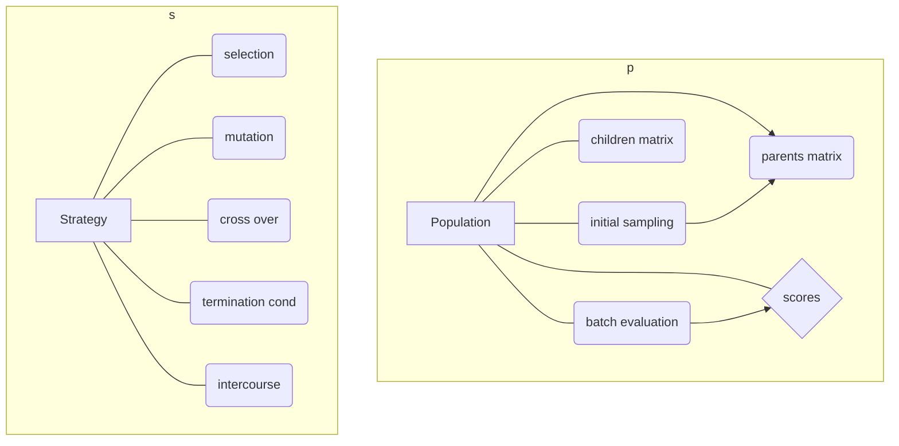

For the clear version with bigger font, please view [there](https://mermaidjs.github.io/mermaid-live-editor/#/view/eyJjb2RlIjoiZ3JhcGggVERcbnN1YmdyYXBoIHBcbkFbUG9wdWxhdGlvbl0tLS1CKGluaXRpYWwgc2FtcGxpbmcpO1xuQS0tPkMocGFyZW50cyBtYXRyaXgpO1xuQi0tPkNcbkEtLS1EKGNoaWxkcmVuIG1hdHJpeClcbkEtLS1zY29yZXtzY29yZXN9XG5BLS0tRShiYXRjaCBldmFsdWF0aW9uKVxuRS0tPnNjb3JlXG5lbmRcbnN1YmdyYXBoIHNcblNbU3RyYXRlZ3ldLS0tU2VsKHNlbGVjdGlvbilcblMtLS1tdXQobXV0YXRpb24pXG5TLS0tY3JvKGNyb3NzIG92ZXIpXG5TLS0tdGVyKHRlcm1pbmF0aW9uIGNvbmQpXG5TLS0taW50KGludGVyY291cnNlKVxuZW5kIiwibWVybWFpZCI6eyJ0aGVtZSI6ImZvcmVzdCJ9fQ).

So the final code should be like:

```java
Population p(dim, par_size, children_size, evaluation, other_stuff);
// using different strategy on different param, like isMultiModel
Strategy s = new Strategy(p, tolerence_for_the_term, other_param_for);
s.run();

```

inside the `s.run()`, maybe we should do this:

```java
while(terminated()){
    //take the population member to access all data
    intercourse();
    mutation();
    crossover();
    selection();
}
```


Note the api name I write is only for presenting, there should be better name than intercourse.

Feel free to modify it if you have better idea!